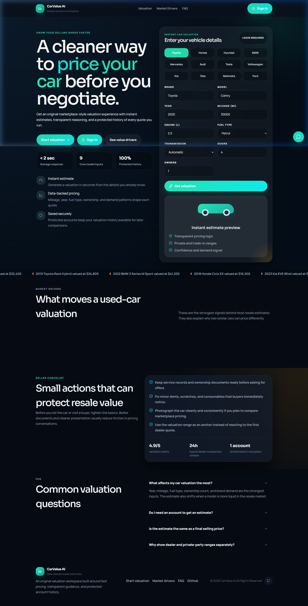

# <p align="center">🚗 CarValue AI | Precision Used-Car Valuation</p>

<p align="center">
  
  
  
  
  
  
</p>

<p align="center">
  <a href="https://car-value-ai-psi.vercel.app/" target="_blank">
    
  </a>
</p>

---

## 🌟 Overview
CarValue AI is a sophisticated end-to-end machine learning application designed to provide instantaneous and highly accurate resale valuations for used vehicles. Built with a focus on **Premium Dark-Mode UI/UX**, **Robust JWT Authentication**, and **Real-Time ML Inference**, it empowers buyers and sellers with data-backed insights before they enter negotiations.

<p align="center">
  
</p>

---

## 🚀 Key Features

### 🛠️ Core Capabilities
| Feature | Description |
| :--- | :--- |
| **🤖 AI Valuation** | Random Forest Regressor calibrated on real-world datasets for hyper-accurate price estimation. |
| **🔐 Secure Auth** | Full JWT-based authentication flow with protected user dashboards and sessions. |
| **📊 Prediction History** | Track and manage all your past valuations in a dedicated activity feed. |
| **💬 AI Copilot** | Integrated valuation assistant grounded in dataset statistics to guide your pricing strategy. |
| **✨ Micro-Animations** | Framer Motion powered transitions and glow effects for a high-end tactile experience. |

---

## 🧠 Machine Learning Engine

### **Performance Metrics**
- **R² Score**: `0.9762` (Explains 97.6% of price variance)
- **Mean Absolute Error (MAE)**: `$370.67`
- **Algorithm**: Random Forest Regressor (100 Estimators)
- **Features**: Brand, Model, Year, Mileage, Engine Size, Fuel Type, Transmission, Doors, Owner Count.

### **Pipeline**
1. **Preprocessing**: Label encoding for categorical variables and feature scaling.
2. **Training**: Optimized using Scikit-Learn with a 80/20 train-test split.
3. **Inference**: FastAPI backend serves the `.pkl` model artifacts with sub-50ms latency.

---

## 🛠️ Technology Stack

### **Frontend (Vercel)**
- **Framework**: React 18 + Vite
- **Styling**: Vanilla CSS3 + Modern Design Tokens (Glassmorphism)
- **Animations**: Framer Motion
- **Icons**: Lucide React

### **Backend (Render)**
- **Runtime**: Python 3.10
- **Framework**: FastAPI (Asynchronous API)
- **Security**: OAuth2 with Password Hashing (Passlib)
- **Database**: SQLite with SQLAlchemy ORM

---

## 📄 Project Structure

| Folder | Description |
| :--- | :--- |
| `frontend/` | React source code, components, and production build config. |
| `backend/` | FastAPI server, auth modules, and database models. |
| `ml/` | Training scripts, data pipeline, and exported model artifacts. |
| `data/` | Source dataset (`car_data.csv`) used for retraining. |

---

## 🔧 Installation & Setup

### **1. Clone the repository**
```bash
git clone https://github.com/PrudhviRaavi/CarValue-AI.git
cd CarValue-AI
```

### **2. Backend Setup**
```bash
cd backend
python -m venv venv
# Activate venv: .\venv\Scripts\activate (Windows) OR source venv/bin/activate (macOS)
pip install -r requirements.txt
uvicorn main:app --reload
```

### **3. Frontend Setup**
```bash
cd frontend
npm install
npm run dev
```

---

## 🤝 Contributing

Contributions are welcome! If you have a suggestion that would make this better, please fork the repo and create a pull request.

👉 **[Read the full Contributing Guide →](docs/CONTRIBUTING.md)**

---

## 📜 License

This project is licensed under the **MIT License** — see the [docs/LICENSE](docs/LICENSE) file for details.

---

## 👨‍💻 Developer

Developed by **[Prudhvi Raavi](https://www.linkedin.com/in/prudhvi-krishna-raavi-64484a315)** | [GitHub](https://github.com/PrudhviRaavi/CarValue-AI)

---

*Disclaimer: CarValue AI provides estimates based on historical data. Market fluctuations and vehicle condition may affect actual resale value.*

